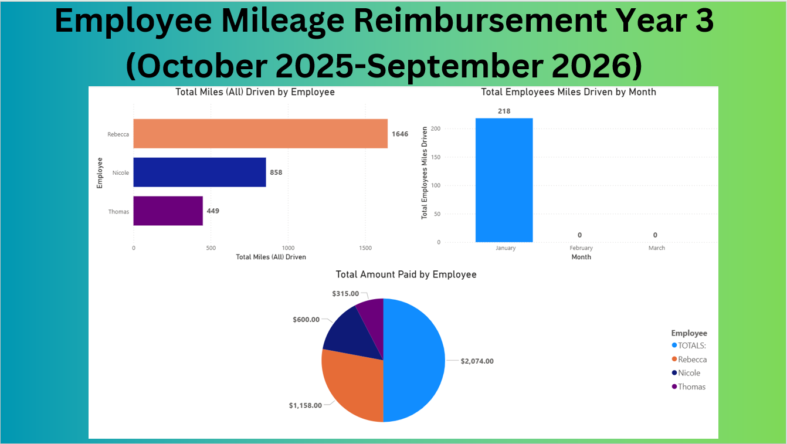
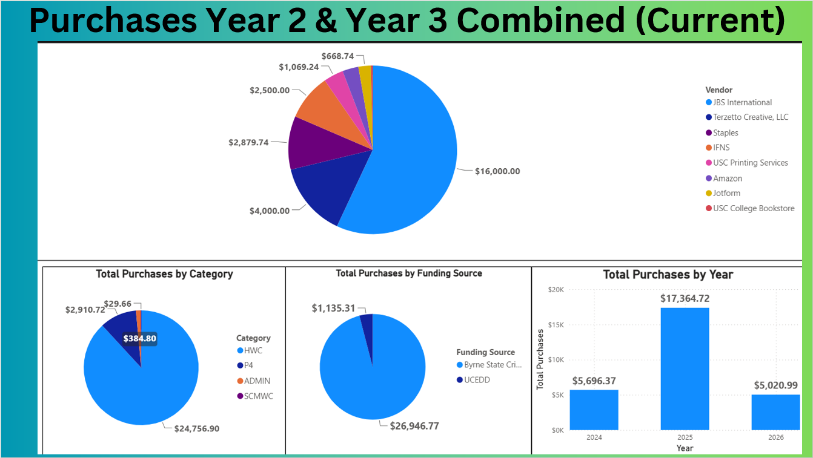
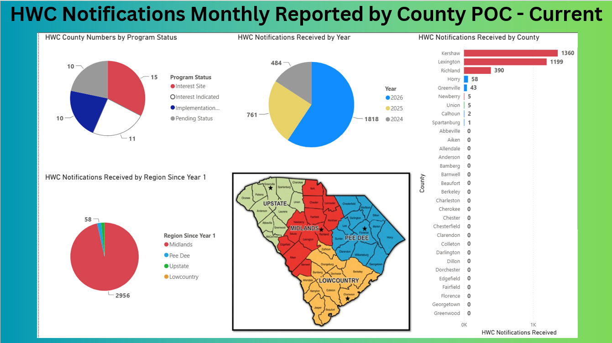
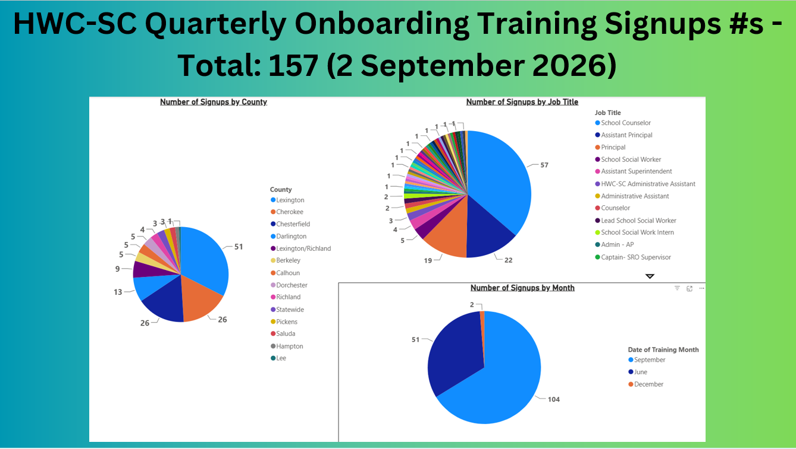
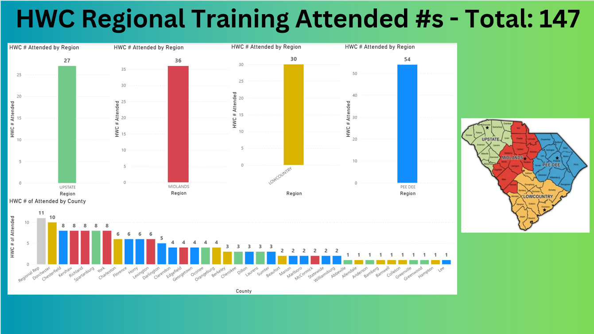
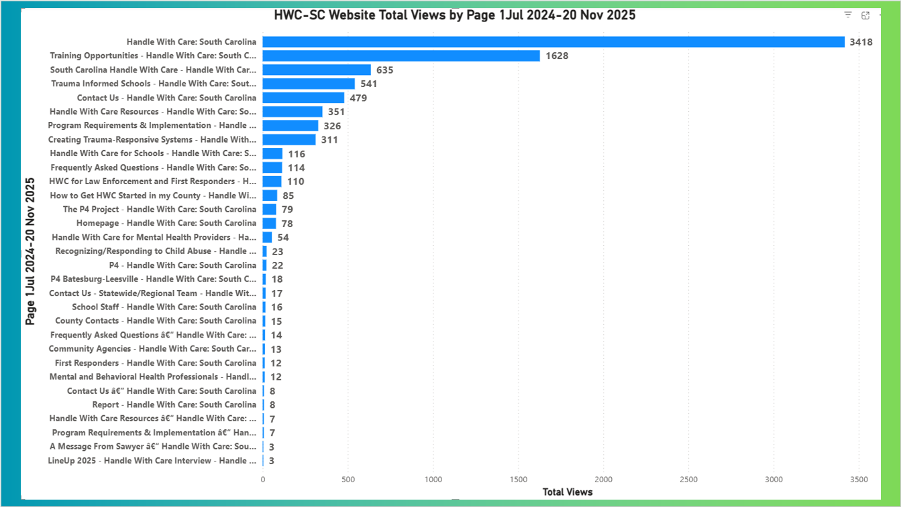

# Power BI Portfolio – Program Reporting & Data Visualization

This repository showcases examples of my experience using Microsoft Power BI
in my role as a Program Assistant with the University of South Carolina.

## Skills Demonstrated

- Microsoft Power BI
- Data visualization
- Dashboard development
- Monthly program reporting
- Data organization and analysis
- KPI tracking
- Report presentation
- Microsoft Excel
- Program performance monitoring

## Examples Included

This portfolio includes examples of Power BI reporting developed in support
of program operations and performance monitoring, including:

- Website analytics and engagement reporting
- County-level incident analysis
- Regional and year-over-year trend analysis
- Quarterly onboarding training registration reporting
- Training attendance analysis
- Program performance visualization
- Narrative interpretation of dashboard findings

## Dashboard Portfolio Preview

### Employee Mileage Reimbursement Reporting

Tracks employee mileage, monthly travel activity, and reimbursement amounts.

### Program Purchases Reporting

Summarizes purchases by vendor, category, funding source, and reporting year.

### HWC Notifications Reporting

Provides county, regional, and year-level views of Handle With Care notifications and program status.

### Quarterly Training Reporting

Analyzes training registrations by county, job title, and training month.

### Regional Attendance Reporting

Displays training attendance across South Carolina regions and counties.

### Website Analytics

Visualizes website traffic and page-level engagement to support program performance monitoring.

## Projects

### Handle With Care – South Carolina Program

Used Power BI to organize and visually present program information and
performance data for reporting purposes.

Key responsibilities included:

- Organizing program data
- Creating visual reports and dashboards
- Identifying trends and activity levels
- Preparing information for leadership and program stakeholders
- Supporting monthly and program-level reporting

### Program Assistant Monthly Report

Developed Power BI visualizations to assist with monthly reporting and
communicating program activities.

The reports helped convert program data into easier-to-understand visual
information for review and presentation.

## Tools

- Microsoft Power BI
- Microsoft Excel
- Microsoft PowerPoint
- Microsoft Office

## Privacy Notice

Screenshots and examples included in this portfolio have been limited or
sanitized to prevent disclosure of confidential, personally identifiable,
or internal organizational information.
